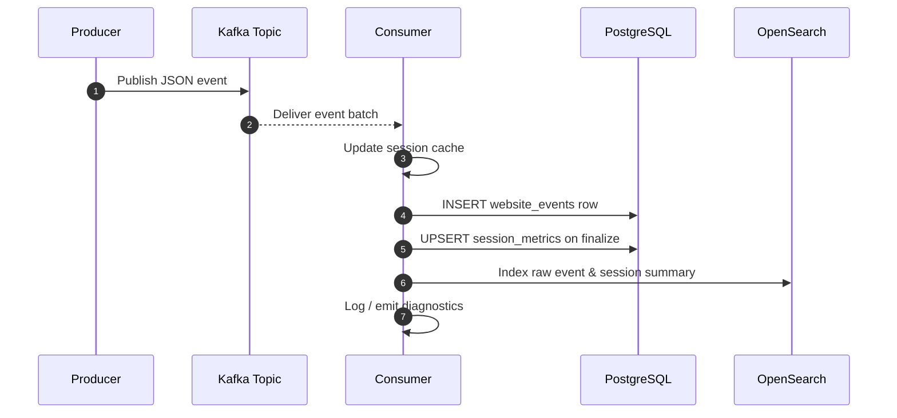

# Aiven Challenge

## Prerequisites

- Python 3.13.7 
- Terraform 1.5.7
- An Aiven account and API token with access to your project

# Download from GitHub

```bash
   git clone https://github.com/SBPnet/aivenChallenge.git
```

## Environment variables

The environment variables are:

- `TF_VAR_AIVEN_API_TOKEN`
- `TF_VAR_AIVEN_PROJECT`

The variables can be set in the shell or in the `terraform.tfvars` file.

## Aiven API token

You can get an API token from the Aiven Console.

## Aiven project

This project is developed using a personal Aiven account, so only the token and project name are required.

Enterprise projects will need to adjust the terraform configuration to match their organization structure.

## Setup

1. **Create a virtual environment**

   A Python virtual environment keeps dependencies isolated from your global interpreter.

   ```bash
   # macOS / Linux
   python -m venv .venv
   source .venv/bin/activate
   ```

   ```powershell
   # Windows PowerShell
   python -m venv .venv
   .venv\Scripts\Activate.ps1
   ```

   After activation, install the project requirements:

   ```bash
   pip install -r requirements.txt
   ```

2. **Export the Aiven API token and project name**

   ```bash
   export TF_VAR_AIVEN_API_TOKEN=<your-api-token>
   export TF_VAR_AIVEN_PROJECT=<your-project-name>
   ```

3. **Alternately Populate `terraform/terraform.tfvars`** (if not already configured) with any required overrides.

## Provision Aiven Services with Terraform

All Terraform commands must be run from the terraform directory (`/aivenChallenge/terraform`).

1. **Initialize Terraform** (only needed on the first run):

   ```bash
   terraform init
   ```

2. **Review the execution plan**:

   ```bash
   terraform plan
   ```

3. **Apply the plan** to create or update the Kafka, PostgreSQL, and OpenSearch services:

   ```bash
   terraform apply
   ```

   Approve the plan when prompted. Terraform will output service connection details, including SSL certificates for Kafka.

4. **Expose outputs locally** (optional but convenient for scripts):

   ```bash
   terraform output -json > terraform-outputs.json
   ```

## Run the Streaming Pipeline

Open two terminals, activating the virtual environment in each (`source .venv/bin/activate`).

1. **Start the consumer** (aggregates session metrics and writes to PostgreSQL and OpenSearch):

   ```bash
   python consumer.py
   ```

2. **Start the producer** (generates synthetic events and publishes them to Kafka):

   ```bash
   python producer.py
   ```

3. Press `Ctrl+C` to stop the scripts. The consumer finalizes any active sessions before exiting.

## Architecture Overview


This diagram reflects the end-to-end topology: `producer.py` sends clickstream events to an Aiven-managed Kafka cluster over TLS. `consumer.py` subscribes to the same topic with TLS-enabled Kafka credentials, enriches the events, and persists them via TLS-secured connections to both PostgreSQL for relational analytics and OpenSearch for near-real-time search and dashboards.

### Event life cycle



## Understand the Sample Applications

### `producer.py`: generating clickstream events

- **Terraform-driven configuration**: `producer.py` shells out to `terraform output -json` to fetch the Kafka bootstrap servers, topic name, and SSL material that Terraform provisioned. This keeps the script environment-agnostic—whenever you recreate infrastructure, simply re-run Terraform and the producer automatically targets the new endpoints.
- **Managed SSL handling**: Aiven services require TLS by default. The helper `_write_pem()` persists the certificate, key, and CA bundle to short-lived temp files, registers them for cleanup via `atexit`, and passes their paths to `KafkaProducer`. Reuse this pattern when you fetch certificates from the Aiven API or Terraform and want to avoid writing secrets to disk permanently.
- **Event payload schema**: `generate_event()` emits a JSON document built with Faker data, choosing among `login`, `page_view`, `click`, and `logout`. Use this function as the blueprint for your own business events: adjust the fields, add validation, or load data from real sources before calling `producer.send()`.
- **Throughput controls**: The module-level constants `NUM_EVENTS` and `DELAY_SECONDS` define how long and how quickly the producer runs.
- **Operational flow**: Inside `main()`, each call to `producer.send()` registers success and error callbacks, prints delivery status, then waits before emitting the next event.

```python
# producer.py (excerpt)
import typing as t

producer = KafkaProducer(
    bootstrap_servers=KAFKA_BOOTSTRAP,
    security_protocol='SSL',
    ssl_cafile=CA_PATH,
    ssl_certfile=CERT_PATH,
    ssl_keyfile=KEY_PATH,
    value_serializer=lambda v: json.dumps(v).encode('utf-8'),
    retries=5,
    acks='all',
    batch_size=16384,
    linger_ms=10
)

def generate_event() -> dict[str, t.Any]:
    event_type = random.choice(['login', 'page_view', 'click', 'logout'])
    user_id = fake.uuid4()
    timestamp = datetime.now().isoformat()
    if event_type == 'login':
        return {'event_type': 'login', 'user_id': user_id, 'timestamp': timestamp, 'success': random.choice([True, False])}
    # ...additional event types omitted for brevity...

future = producer.send(WEBSITE_EVENTS_TOPIC, value=generate_event())
future.add_callback(lambda md: print(f"Event sent to partition {md.partition}"))
future.add_errback(lambda exc: print(f"Error sending event: {exc}"))
```

### `consumer.py`: aggregating and persisting events

- **Bootstrap from Terraform outputs**: Like the producer, `consumer.py` retrieves the Kafka, PostgreSQL, and OpenSearch connection details via `terraform output -json`. That means the consumer always reads the same credentials Terraform just provisioned, eliminating manual copy-paste errors.
- **Secure, resilient Kafka consumption**: The `KafkaConsumer` is configured with TLS paths, `auto_offset_reset='earliest'`, and `enable_auto_commit=True`. For production workloads, consider supplying a custom consumer group, disabling auto commit, or wiring in retry logic around transient errors.
- **Relational storage**: `_ensure_table_exists()` creates `website_events` and `session_metrics` if they are missing. Each Kafka message inserts a row into `website_events` using parameterized SQL, ensuring input validation and preventing SQL injection. When adapting this script, keep the parameterized pattern and extend the table schema to match your fields.
- **Session aggregation workflow**: The consumer maintains in-memory session state keyed by `user_id`. Helpers like `_start_new_session()`, `_update_session_metrics()`, `_finalize_session()`, and `_finalize_expired_sessions()` roll up individual events into session-level metrics. Adjust `SESSION_TIMEOUT` or the aggregation logic to reflect your business definition of a session.
- **Search indexing**: The same event is indexed into OpenSearch via `opensearch_conn.index()`, making it immediately searchable. The session summaries are also written back when `_finalize_session()` runs. Swap the index names or mapping to match your Aiven OpenSearch cluster conventions.
- **Lifecycle management**: On shutdown (`KeyboardInterrupt`), the consumer flushes outstanding session state, closes Kafka, PostgreSQL, and OpenSearch clients, and keeps resources tidy. Preserve this structure when you extend the script so that stateful aggregations are not lost on exit.


```python
# consumer.py (excerpt)
import typing as t

consumer = KafkaConsumer(
    WEBSITE_EVENTS_TOPIC,
    bootstrap_servers=KAFKA_BOOTSTRAP,
    security_protocol='SSL',
    ssl_cafile=CA_PATH,
    ssl_certfile=CERT_PATH,
    ssl_keyfile=KEY_PATH,
    value_deserializer=lambda x: json.loads(x.decode('utf-8')),
)

def _handle_session(event: dict[str, t.Any]) -> None:
    user_id = event.get('user_id')
    event_time = _parse_event_timestamp(event)
    session_state = _active_sessions.get(user_id) or _start_new_session(user_id, event_time)
    _update_session_metrics(session_state, event, event_time)
    if event.get('event_type') == 'logout':
        _finalize_session(user_id)

for message in consumer:
    event = message.value
    with pg_conn.cursor() as cursor:
        cursor.execute(
            "INSERT INTO website_events (event_type, user_id, timestamp, ip, device, success) VALUES (%s, %s, %s, %s, %s, %s)",
            (
                event.get('event_type'),
                event.get('user_id'),
                event.get('timestamp'),
                event.get('ip'),
                event.get('device'),
                event.get('success'),
            ),
        )
        pg_conn.commit()
    _handle_session(event)
    opensearch_conn.index(index='website-events', body=event)
```

## Inspect the Results

- **PostgreSQL**: Connect using the pgcli tool and the URI from `terraform output challenge_postgres_service_uri`, then query:

  ```bash
  pgcli "<terraform output challenge_postgres_service_uri>"
  ```

  ```sql
  SELECT * FROM session_metrics ORDER BY start_time DESC LIMIT 10;
  ```

- **OpenSearch Dashboards**:
  1. Convert the OpenSearch URI from `terraform output challenge_opensearch_service_uri` to port `443` and open it in a browser.
  2. Log in with the credentials embedded in the URI.
  3. Create data views for `website-events*` and `session-metrics*` to explore raw events and aggregated sessions.
